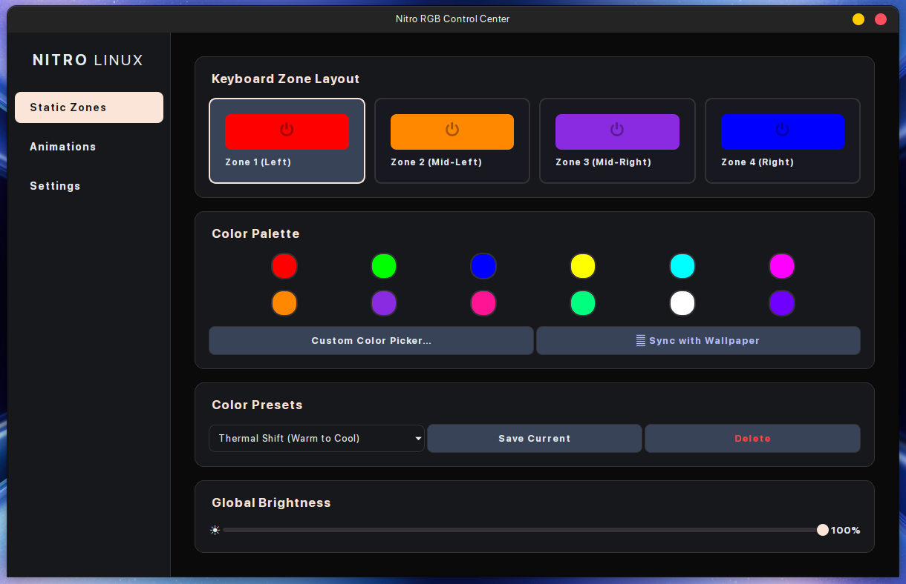

# GUI for Acer RGB keyboard linux Module

NitroRGB is a complete graphical interface and system automation suite for Acer Nitro keyboards on Linux. It provides a modern PyQt5 interface for customizing zones and animations, while utilizing shell scripts to integrate deeply with the system via udev, systemd, and XDG autostart.

---


---

## ✨ Core Features

* **Complete Hardware Control:** Adjust static zones, set global brightness, or use smooth animations like Wave, Breath, Neon, Shifting, and Zoom.
* **Wallpaper Sync & Presets:** Extract colors dynamically from your background or choose from built-in presets like *Pastel Sky* and *Arctic Ice*.
* **Automated Startup Animation:** A desktop autostart entry runs a silent wipe effect automatically when you log into your desktop session.
* **Systemd Shutdown Hook:** A dedicated shutdown script turns the keyboard completely red during system power-off, checking your GUI settings to ensure animations are enabled before running.
* **Permission Management:** Automatically provisions udev rules for `/dev/acer-gkbbl-0` to allow non-root hardware access safely.

---

## ⚙️ Dependencies

Before installing NitroRGB, ensure you have the required backend tools and Python libraries installed.

**1. Hardware Backend:**

* [`facer-rgb`](https://www.google.com/search?q=%23) (Required for underlying hardware communication)

**2. Python Libraries:**
This application requires Python 3, PyQt5 (for the GUI), and Pillow/ColorThief (for the wallpaper sync feature). Because NitroRGB relies on system-level hooks, it is highly recommended to install the core libraries via your system package manager, and use `pip` for `colorthief`:

* **Arch Linux :**

```bash
sudo pacman -S python-pyqt5 python-pillow
pip install colorthief --break-system-packages

```

* **Debian / Ubuntu Based :**

```bash
sudo apt install python3-pyqt5 python3-pil
pip3 install colorthief --break-system-packages

```

* **Fedora :**

```bash
sudo dnf install python3-qt5 python3-pillow
pip install colorthief

```

*(Note: If you manage your Python environments using virtual environments, you can install all of them via pip using `pip install PyQt5 Pillow colorthief`).*

---


## 🚀 Installation

The provided `install.sh` script handles everything from copying binaries to registering systemd services.

1. Clone the repository and navigate into the directory:
```bash
git clone https://github.com/yourusername/NitroRGB.git
cd NitroRGB

```


2. Make the installer executable and run it as root:
```bash
chmod +x install.sh
sudo ./install.sh

```


**What the installer does:**

* Verifies the presence of the `facer-rgb` CLI tool.
* Copies the main application to `/usr/local/bin/nitrorgb`.
* Configures udev rules and ensures the `acer_wmi` kernel module auto-loads at boot.
* Seeds the default JSON configuration to `~/.config/` and `/etc/skel`.
* Registers the desktop application launcher and XDG session autostart entry.
* Installs `nitro-red-shutdown.sh` and enables the `nitro-rgb-shutdown.service` via systemd.

---

## 💻 Usage

### GUI Configuration

Launch the Control Center from your application menu, or run it directly from your terminal:

```bash
nitrorgb

```

*Note: Your custom palettes, presets, and preferences are saved locally to `~/.config/nitro_rgb_config.json`.*

### Silent Execution

To trigger the background wipe animation manually without opening the graphical interface :

```bash
nitrorgb --silent

```

---

## 🧹 Uninstallation

To completely remove the suite and clean up all system hooks, use the provided `uninstall.sh` script.

```bash
chmod +x uninstall.sh
sudo ./uninstall.sh

```

* *Note: The underlying `facer-rgb` driver and your personal configuration files in `~/.config` are left untouched.*

---

## 📄 License

[MIT](https://www.google.com/search?q=https://choosealicense.com/licenses/mit/)